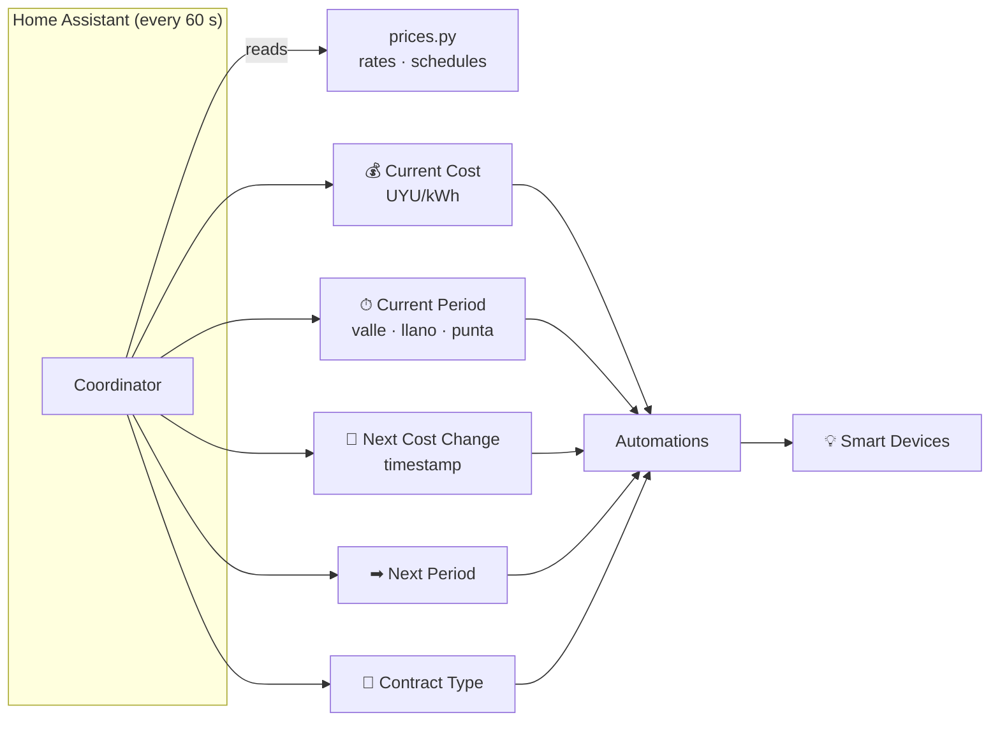

# HACS - UTE Tarifas Residenciales


**HACS custom integration — residential UTE contracts only.**

> ⚠️ **Unofficial project — not affiliated with or endorsed by UTE (Administración Nacional de Usinas y Trasmisiones Eléctricas) in any way.**

Exposes the **current electricity price (UYU/kWh)** and the **current tariff
period** (*valle*, *llano*, *punta*, or *simple*) based on your UTE contract
and the official UTE tariff tables. Use these sensors in automations to turn
appliances on or off depending on the active period, and track the real cost
of your electricity consumption.

[](https://hacs.xyz/)
[](LICENSE)
[](https://github.com/alexisml/ha-ute-tariffs/releases/latest)

[](https://github.com/alexisml/ha-ute-tariffs/actions/workflows/hacs-validate.yml)
[](https://github.com/alexisml/ha-ute-tariffs/actions/workflows/tests.yml)
[](https://github.com/alexisml/ha-ute-tariffs/actions/workflows/tests.yml)
[](https://codecov.io/gh/alexisml/ha-ute-tariffs)
[](https://github.com/alexisml/ha-ute-tariffs/actions/workflows/ruff.yml)
[](https://github.com/alexisml/ha-ute-tariffs/actions/workflows/type-check.yml)
[](https://github.com/alexisml/ha-ute-tariffs/actions/workflows/spell-check.yml)
[](https://github.com/alexisml/ha-ute-tariffs/actions/workflows/codeql.yml)
[](https://github.com/alexisml/ha-ute-tariffs/actions/workflows/gitleaks.yml)
[](https://github.com/alexisml/ha-ute-tariffs/blob/main/.github/dependabot.yml)
[](https://github.com/alexisml/ha-ute-tariffs)

---

## 🤖 AI Disclosure

A significant portion of this project — including code, documentation, and
design — was developed with the assistance of AI tools (GitHub Copilot /
large-language models). All AI-generated output has been reviewed, but users
and contributors should audit the code independently before relying on it in
production environments.

---

## What it does



### Main sensors

| Sensor | Unit | Description |
|--------|------|-------------|
| `current_cost` | UYU/kWh | Price per kilowatt-hour right now |
| `current_period` | — | `valle`, `llano`, `punta`, or `simple` |
| `next_change` | timestamp | When the current period or pricing changes |
| `next_period` | — | Period active after the next change |
| `contract_type` | — | `simple`, `double`, or `triple` |

All sensors are grouped under a single **UTE Tarifas** device in the HA UI.

---

## Quick install

### Via HACS (recommended)

1. In HACS → **Custom repositories** → add `https://github.com/alexisml/ha-ute-tariffs` as **Integration**.
2. Search **UTE Tarifas** and click **Download**.
3. Restart Home Assistant.
4. **Settings › Devices & Services › + Add Integration → UTE Tarifas**.

### Manually

```bash
# Copy to your HA config directory
cp -r custom_components/ute_tarifas/ /config/custom_components/ute_tarifas/
```

Restart Home Assistant and add the integration from the UI.

---

## Configuration

| Field | Default | Description |
|-------|---------|-------------|
| **Contract type** | `simple` | `simple`, `double`, or `triple` |
| **Punta (peak) window** | `18-22` | 4-hour peak window for Double/Triple contracts: `17-21`, `18-22`, or `19-23`. Ignored for Simple. |
| **Monthly consumption entity** | *(none)* | Optional entity ID reporting monthly kWh (e.g. a utility meter); used to select the Simple tier. If left blank or unavailable, the cheapest tier (0–100 kWh/month) is used. |
| **Apply national holidays** | `true` | Toggle holiday detection on/off |

---

## Automation examples

### Turn off the water heater during peak hours

```yaml
automation:
  - alias: "Water heater off during punta"
    trigger:
      - platform: state
        entity_id: sensor.ute_tarifas_current_period
        to: "punta"
    action:
      - service: switch.turn_off
        target:
          entity_id: switch.water_heater
```

### Start the dishwasher when off-peak begins

```yaml
automation:
  - alias: "Start dishwasher at valle"
    trigger:
      - platform: state
        entity_id: sensor.ute_tarifas_current_period
        to: "valle"
    action:
      - service: switch.turn_on
        target:
          entity_id: switch.dishwasher
```

### Condition on current cost in a script

```yaml
condition:
  - condition: numeric_state
    entity_id: sensor.ute_tarifas_current_cost
    below: 7.0
```

---

## Prices and schedules

Canonical UTE tariff data lives in
[`custom_components/ute_tarifas/prices.py`](custom_components/ute_tarifas/prices.py).

Both prices and schedules use **date-bounded ranges** — adding a new entry with
a future `start` date causes the `next_change` sensor to automatically count
down to that date, and all sensors switch to the new values on that day without
any user action.

See **[Development Guide → Updating prices](docs/documentation/04-development-guide.md#how-to-update-prices)**
for step-by-step instructions.

---

## Documentation

| Document | Description |
|----------|-------------|
| [User Manual](docs/documentation/01-user-manual.md) | Overview and quick-start |
| [Installation & Setup](docs/documentation/02-installation-and-setup.md) | Full install guide and automation examples |
| [How It Works](docs/documentation/03-how-it-works.md) | Architecture, timezone handling, sensors |
| [Development Guide](docs/documentation/04-development-guide.md) | Updating prices/schedules, running tests |
| [Troubleshooting](docs/documentation/05-troubleshooting-and-debugging.md) | Fixing common problems |
| [Contributing](CONTRIBUTING.md) | How to contribute |
| [Security](SECURITY.md) | Reporting vulnerabilities |
| [Code of Conduct](CODE_OF_CONDUCT.md) | Community standards |

---

## License

Licensed under the [Apache 2.0 License](LICENSE).

UTE is a trademark of Administración Nacional de Usinas y Trasmisiones
Eléctricas (UTE).  This project is not affiliated with or endorsed by UTE.
