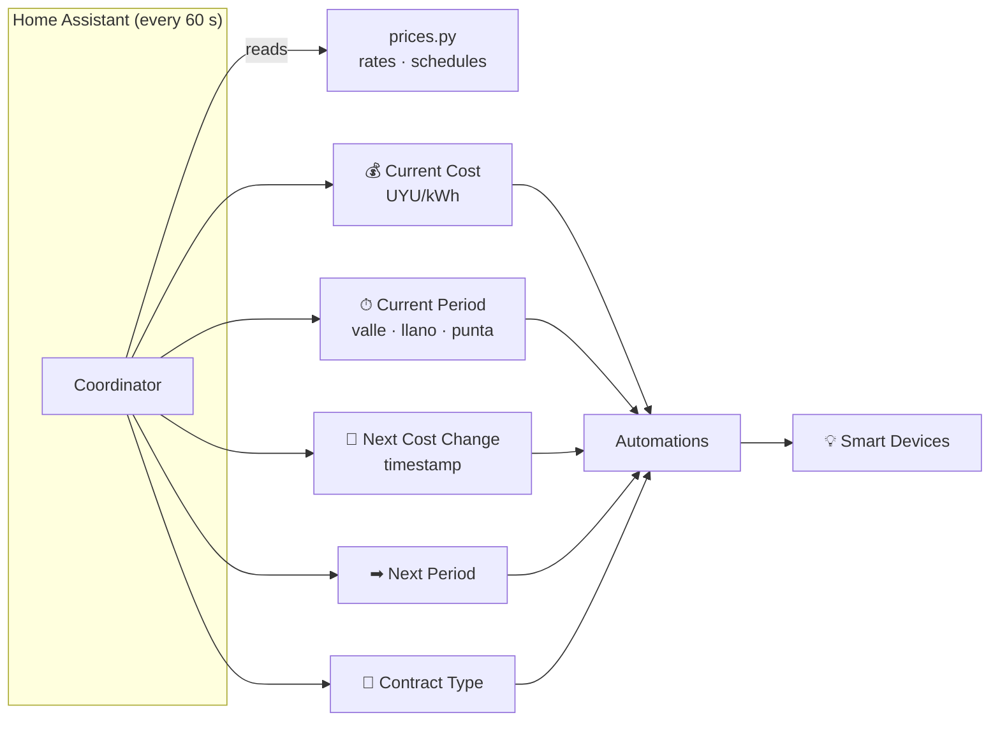

# UTE Tarifas


**HACS custom integration — residential UTE contracts only.**

> ⚠️ **Unofficial project — not affiliated with or endorsed by UTE (Administración Nacional de Usinas y Trasmisiones Eléctricas) in any way.**

Exposes **15 Home Assistant sensors** — 5 main sensors (current tariff cost
and period, next change time and period, contract type) plus 10 diagnostic
sensors (price ex-IVA, IVA rate, and one per price tier) — that track the
current UTE electricity tariff. Use the main sensors in automations to shift
high-consumption appliances to off-peak hours and save on your electricity
bill.

[](https://hacs.xyz/)
[](LICENSE)
[](https://github.com/alexisml/UTE-Tarifas/releases/latest)

[](https://github.com/alexisml/UTE-Tarifas/actions/workflows/hacs-validate.yml)
[](https://github.com/alexisml/UTE-Tarifas/actions/workflows/tests.yml)
[](https://github.com/alexisml/UTE-Tarifas/actions/workflows/tests.yml)
[](https://codecov.io/gh/alexisml/UTE-Tarifas)
[](https://github.com/alexisml/UTE-Tarifas/actions/workflows/ruff.yml)
[](https://github.com/alexisml/UTE-Tarifas/actions/workflows/type-check.yml)
[](https://github.com/alexisml/UTE-Tarifas/actions/workflows/spell-check.yml)
[](https://github.com/alexisml/UTE-Tarifas/actions/workflows/codeql.yml)
[](https://github.com/alexisml/UTE-Tarifas/actions/workflows/gitleaks.yml)
[](https://github.com/alexisml/UTE-Tarifas/blob/main/.github/dependabot.yml)
[](https://github.com/alexisml/UTE-Tarifas)

---

## 🤖 AI Disclosure

A significant portion of this project — including code, documentation, and
design — was developed with the assistance of AI tools (GitHub Copilot /
large-language models). All AI-generated output has been reviewed, but users
and contributors should audit the code independently before relying on it in
production environments.

---

## What it does



### Five sensors

| Sensor | Unit | Description |
|--------|------|-------------|
| `current_cost` | UYU/kWh | Price per kilowatt-hour right now |
| `current_period` | — | `valle`, `llano`, `punta`, or `simple` |
| `next_change` | timestamp | When the current period or pricing changes |
| `next_period` | — | Period active after the next change |
| `contract_type` | — | `simple`, `double`, or `triple` |

All sensors are grouped under a single **UTE Tarifas** device in the HA UI.

---

## Quick install

### Via HACS (recommended)

1. In HACS → **Custom repositories** → add `https://github.com/alexisml/UTE-Tarifas` as **Integration**.
2. Search **UTE Tarifas** and click **Download**.
3. Restart Home Assistant.
4. **Settings › Devices & Services › + Add Integration → UTE Tarifas**.

### Manually

```bash
# Copy to your HA config directory
cp -r custom_components/ute_tarifas/ /config/custom_components/ute_tarifas/
```

Restart Home Assistant and add the integration from the UI.

---

## Configuration

| Field | Default | Description |
|-------|---------|-------------|
| **Contract type** | `simple` | `simple`, `double`, or `triple` |
| **Workday schedule override** | *(built-in)* | Leave blank to use the default workday schedule for your contract type |
| **Weekend schedule override** | *(built-in)* | Leave blank to use the default (all-llano for Double, all-valle for Triple) |
| **Holiday schedule override** | *(built-in)* | Leave blank to use the default (all-llano for Double, all-valle for Triple) |
| **Monthly consumption entity** | *(none)* | Optional entity ID reporting monthly kWh (e.g. a utility meter); used to select the Simple tier. If left blank or unavailable, the cheapest tier (0–100 kWh/month) is used. |
| **Holiday country code** | `UY` | ISO 3166-1 alpha-2 (e.g. `UY`, `AR`) |
| **Apply national holidays** | `true` | Toggle holiday detection on/off |

### Custom schedule format

```
HH:MM-HH:MM:period,HH:MM-HH:MM:period,...
```

Valid periods: `valle`, `llano`, `punta`, `simple`.
Use `00:00` as end time to mean "until midnight".

**Double workday example** (00:00–18:00 llano, 18:00–22:00 punta, 22:00–00:00 llano):
```
00:00-18:00:llano,18:00-22:00:punta,22:00-00:00:llano
```

---

## Automation examples

### Turn off the water heater during peak hours

```yaml
automation:
  - alias: "Water heater off during punta"
    trigger:
      - platform: state
        entity_id: sensor.ute_tarifas_current_period
        to: "punta"
    action:
      - service: switch.turn_off
        target:
          entity_id: switch.water_heater
```

### Start the dishwasher when off-peak begins

```yaml
automation:
  - alias: "Start dishwasher at valle"
    trigger:
      - platform: state
        entity_id: sensor.ute_tarifas_current_period
        to: "valle"
    action:
      - service: switch.turn_on
        target:
          entity_id: switch.dishwasher
```

### Condition on current cost in a script

```yaml
condition:
  - condition: numeric_state
    entity_id: sensor.ute_tarifas_current_cost
    below: 7.0
```

---

## Prices and schedules

Canonical UTE tariff data lives in
[`custom_components/ute_tarifas/prices.py`](custom_components/ute_tarifas/prices.py).

Both prices and schedules use **date-bounded ranges** — adding a new entry with
a future `start` date causes the `next_change` sensor to automatically count
down to that date, and all sensors switch to the new values on that day without
any user action.

See **[Development Guide → Updating prices](docs/documentation/04-development-guide.md#how-to-update-prices)**
for step-by-step instructions.

---

## Documentation

| Document | Description |
|----------|-------------|
| [User Manual](docs/documentation/01-user-manual.md) | Overview and quick-start |
| [Installation & Setup](docs/documentation/02-installation-and-setup.md) | Full install guide and automation examples |
| [How It Works](docs/documentation/03-how-it-works.md) | Architecture, timezone handling, sensors |
| [Development Guide](docs/documentation/04-development-guide.md) | Updating prices/schedules, running tests |
| [Troubleshooting](docs/documentation/05-troubleshooting-and-debugging.md) | Fixing common problems |
| [Contributing](CONTRIBUTING.md) | How to contribute |
| [Security](SECURITY.md) | Reporting vulnerabilities |
| [Code of Conduct](CODE_OF_CONDUCT.md) | Community standards |

---

## License

Licensed under the [Apache 2.0 License](LICENSE).

UTE is a trademark of Administración Nacional de Usinas y Trasmisiones
Eléctricas (UTE).  This project is not affiliated with or endorsed by UTE.
