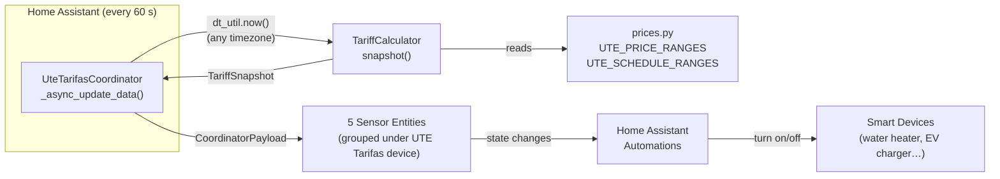
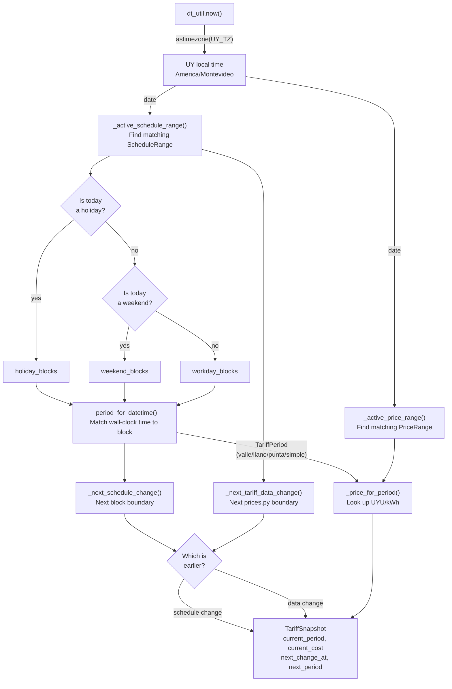

# How It Works

## Architecture overview



---

## Step-by-step: what happens every minute



---

## Timezone handling

**All date and time comparisons use UY local time (`America/Montevideo`).**

`dt_util.now()` returns the current time in the timezone configured on the
Home Assistant server (often UTC).  The very first line of `TariffCalculator.snapshot()`
converts it:

```python
now = now.astimezone(UY_TZ)   # America/Montevideo
```

This ensures that a server running in UTC at `01:30 UTC` correctly identifies
the UY local time as `22:30 UY (previous day)` and uses the Monday schedule —
not Tuesday's.

---

## Date-bounded price and schedule ranges

Both `UTE_PRICE_RANGES` and `UTE_SCHEDULE_RANGES` (defined in `prices.py`) use
`[start, end]` date ranges.  The calculator selects the entry whose range covers
today's UY date:

```
2026-01-01  ──────────────────────────────  2099-12-31
            ↑ PriceRange / ScheduleRange A

# After a price update:
2026-01-01  ──  2026-11-30  |  2026-12-01  ──  2099-12-31
            Range A (old)   |  Range B (new)
                            ↑ boundary detected by _next_tariff_data_change()
```

When a new entry is added to `prices.py` with a future `start` date, the
`next_change_at` sensor automatically starts counting down to that date —
before the change happens.  No HA restart or user action is needed.

---

## Schedule blocks

A schedule is a list of `TimeBlock(start, end, period)` objects covering a
24-hour day.

### Midnight sentinel (`end = time(0, 0)`)

`time(0, 0)` as the `end` of a block means "until midnight" (i.e. the block
runs to the end of the calendar day).  The `_contains()` helper detects this
wrap-around case:

```python
# Block 22:00 – 00:00 (covers 22:00, 22:01, …, 23:59)
TimeBlock(time(22, 0), time(0, 0), TariffPeriod.LLANO)
```

The all-day sentinel `time(0, 0) – time(0, 0)` is used for SIMPLE contracts
and all-day weekend/holiday blocks — it always matches any time.

### Default workday blocks (built-in)

**Double contract (Doble Horario):**

| Block | Period |
|-------|--------|
| 00:00 – 18:00 | Llano |
| 18:00 – 22:00 | Punta |
| 22:00 – 00:00 | Llano |

Weekends and holidays are **all-llano** for Double.

**Triple contract (Triple Horario):**

| Block | Period |
|-------|--------|
| 00:00 – 07:00 | Valle |
| 07:00 – 18:00 | Llano |
| 18:00 – 22:00 | Punta |
| 22:00 – 00:00 | Llano |

Weekends and holidays are **all-valle** for Triple.

---

## Holiday detection

Holiday detection uses the `holidays` Python package — the same package used
by Home Assistant's built-in `workday` and `holiday` integrations.

```python
import holidays
value in holidays.country_holidays("UY", years=value.year)
```

The package is pinned to an **exact version** matching what HA 2025.5.0 ships
(currently `holidays==0.70`).  A CI workflow (`.github/workflows/ha-holidays-check.yml`)
warns when the pins diverge, so the dev environment always matches the runtime
package that HA provides — eliminating version-conflict risk.

Holiday detection can be disabled per-entry with the **Apply national holidays**
toggle.  The country code defaults to `UY` but can be changed to any ISO
3166-1 alpha-2 code (e.g. `AR` for Argentina).

---

## Prices, IVA, and tiers

All prices stored in `prices.py` are in **UYU/kWh excluding IVA** (Uruguay's
22 % *Impuesto al Valor Agregado*).  The integration applies IVA automatically.
Every tariff tier for all contract types is also exposed as a diagnostic sensor
so you can see each rate at a glance — see the sensor table below.

### Simple contract tiers

The *Simple* tariff has three consumption tiers (monthly kWh):

| Tier | Threshold | Rate (excl. IVA) |
|------|-----------|-----------------|
| Low | 0 – 100 kWh/month | 6.744 UYU/kWh |
| Mid | 101 – 600 kWh/month | 8.452 UYU/kWh |
| High | 601+ kWh/month | 10.539 UYU/kWh |

Link a **Monthly consumption entity** in the setup form — an HA sensor (e.g. a
utility meter) that reports your total monthly kWh.  The integration reads its
state at each update to select the correct tier automatically.  If the field is
left blank or the entity is unavailable, the cheapest tier (Low) is used.
For Double and Triple contracts this field is ignored.

---

## The sensors

| Key | Category | Unit | Description |
|-----|----------|------|-------------|
| `current_cost` | — | UYU/kWh | Price per kWh right now, **including IVA**. |
| `current_period` | — | — | `valle`, `llano`, `punta`, or `simple`. |
| `next_change` | — | timestamp | When the current period or pricing will next change. |
| `next_period` | — | — | The period that will be active after `next_change`. |
| `contract_type` | — | — | `simple`, `double`, or `triple`. |
| `current_cost_excl_iva` | Diagnostic | UYU/kWh | Price per kWh right now, **excluding IVA**. |
| `iva_rate` | Diagnostic | % | IVA rate applied (22 %). |
| `price_simple_low` | Diagnostic | UYU/kWh | Simple — low tier rate excl. IVA (0–100 kWh/month). |
| `price_simple_mid` | Diagnostic | UYU/kWh | Simple — mid tier rate excl. IVA (101–600 kWh/month). |
| `price_simple_high` | Diagnostic | UYU/kWh | Simple — high tier rate excl. IVA (601+ kWh/month). |
| `price_double_llano` | Diagnostic | UYU/kWh | Double — llano rate excl. IVA. |
| `price_double_punta` | Diagnostic | UYU/kWh | Double — punta rate excl. IVA. |
| `price_triple_valle` | Diagnostic | UYU/kWh | Triple — valle rate excl. IVA. |
| `price_triple_llano` | Diagnostic | UYU/kWh | Triple — llano rate excl. IVA. |
| `price_triple_punta` | Diagnostic | UYU/kWh | Triple — punta rate excl. IVA. |

`next_change` takes whichever is **earliest** — the next time-of-use block
boundary where the period actually changes *or* a future pricing/schedule update
encoded in `prices.py`.  Boundaries where the same period continues (e.g.
Saturday→Sunday both all-llano) are skipped so the sensor only surfaces
meaningful changes.

All sensors belong to a single **UTE Tarifas** device in HA, grouped under
`manufacturer: UTE, model: Residential Tariff`.

---

*← [Installation & Setup](02-installation-and-setup.md) · [Development Guide →](04-development-guide.md)*
