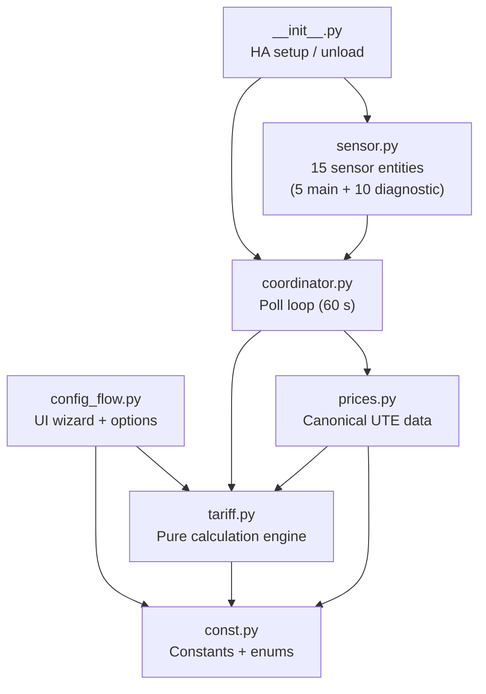

# Development Guide

## Prerequisites

| Tool | Version |
|------|---------|
| Python | ≥ 3.12 |
| pip | current |
| git | current |

---

## Local setup

```bash
git clone https://github.com/alexisml/UTE-Tarifas.git
cd UTE-Tarifas
pip install -e ".[dev]"
```

This installs the integration in editable mode along with all development
dependencies (`ruff`, `pyright`, `pytest`, `pytest-cov`, `holidays`).

---

## Running checks

```bash
# Lint (ruff)
ruff check .

# Type check (pyright)
pyright

# Tests with coverage
pytest -q
```

The test suite enforces ≥ 90 % coverage on `tariff.py` (the pure-Python
calculation engine).  The HA-dependent modules (`__init__`, `config_flow`,
`sensor`, `coordinator`) are validated by the HACS Action CI workflow.

---

## Module map



---

## How to update prices

When UTE announces new residential rates:

1. Open `custom_components/ute_tarifas/prices.py`.
2. Set `end` on the last entry in `UTE_PRICE_RANGES` to the day **before** the
   new rates apply.
3. Append a new `PriceRange` with the new rates and the correct `start` /
   `end` dates.

```python
# Before
PriceRange(
    start=date(2026, 1, 1), end=date(2099, 12, 31),
    simple_low=6.744, simple_mid=8.452, simple_high=10.539,
    double_llano=4.771, double_punta=12.034,
    triple_valle=2.443, triple_llano=5.172, triple_punta=12.034,
),

# After (example: rates change on 2026-12-01)
PriceRange(
    start=date(2026, 1, 1), end=date(2026, 11, 30),
    simple_low=6.744, simple_mid=8.452, simple_high=10.539,
    double_llano=4.771, double_punta=12.034,
    triple_valle=2.443, triple_llano=5.172, triple_punta=12.034,
),
PriceRange(
    start=date(2026, 12, 1), end=date(2099, 12, 31),
    simple_low=7.0, simple_mid=8.8, simple_high=11.0,
    double_llano=5.0, double_punta=12.5,
    triple_valle=2.5, triple_llano=5.4, triple_punta=12.5,
),
```

The `next_change_at` sensor will start counting down to `2026-12-01` as soon
as the repository update is pulled by HACS — no user action is needed.

---

## How to update a schedule

When UTE announces new time-of-use hours:

1. Open `custom_components/ute_tarifas/prices.py`.
2. Find the relevant contract type in `UTE_SCHEDULE_RANGES`.
3. Set `end` on the last entry to the day **before** the new schedule applies.
4. Append a new `ScheduleRange` with the revised `TimeBlock` list.

```python
# Example: Triple punta changes from 17:00–21:00 to 18:00–22:00 on 2027-01-01
ScheduleRange(
    start=date(2027, 1, 1),
    end=date(2099, 12, 31),
    workday_blocks=[
        TimeBlock(time(0, 0),  time(7, 0),  TariffPeriod.VALLE),
        TimeBlock(time(7, 0),  time(18, 0), TariffPeriod.LLANO),
        TimeBlock(time(18, 0), time(22, 0), TariffPeriod.PUNTA),
        TimeBlock(time(22, 0), time(0, 0),  TariffPeriod.LLANO),
    ],
    weekend_blocks=_VALLE_ALL_DAY,
    holiday_blocks=_VALLE_ALL_DAY,
),
```

---

## `holidays` package version check

The CI workflow **`.github/workflows/ha-holidays-check.yml`** runs on every
push and pull request to keep our local dev environment in sync with the
version of `holidays` that HA ships at runtime.

**Design rationale** — `holidays` is *not* declared in `manifest.json`.  HA
already ships it for its built-in `workday` and `holiday` components, so we
inherit it at runtime without risk of a version conflict.  The
`pyproject.toml` dev dependency pins the *exact* same version so local tests
run against the same package as production.

**What the workflow does:**

1. Resolves the latest *stable* HA release tag via the GitHub API.
2. Reads the pinned `holidays==X.Y` requirement from HA's `workday/manifest.json`
   at that tag.
3. Reads the `holidays==X.Y` pin from our `pyproject.toml` dev dependencies.
4. **Warns** (does not fail) if they differ — a different version does not
   automatically break the integration, but it means tests are running against
   a different package than production.

**Action when the warning fires:**

```bash
# 1. Update the pin in pyproject.toml
#    Change  "holidays==OLD"  →  "holidays==HA_VER"
#    Update the comment above it:  # Pin to match HA YYYY.MM.0

# 2. Install and test
pip install -e ".[dev]"
pytest

# 3. If tests pass, commit.  If they fail, investigate the breaking change.
#    Pay special attention to major-version bumps (v0 → v1) which carry
#    potential API changes to country_holidays().
```

---

## Adding a new sensor

1. Add a new `UteTarifasSensorDescription` to `SENSOR_TYPES` in `sensor.py`.
2. Set a unique `key` and `translation_key` (they can be the same value).
3. Implement `value_fn` — it receives a `CoordinatorPayload` and returns the
   sensor value.
4. Add the sensor name (and optional state translations) to
   `strings.json` and both `translations/*.json` files under
   `entity.sensor.<translation_key>`.

---

## Release process

1. Update `prices.py` if rates or schedules have changed.
2. Update `CHANGELOG.md` (create it if it does not exist).
3. Bump the version in `hacs.json` and `manifest.json` if applicable.
4. Open a pull request; the CI suite must pass.
5. Merge to `main`; HACS users will receive the update automatically.

---

*← [How It Works](03-how-it-works.md) · [Troubleshooting →](05-troubleshooting-and-debugging.md)*
